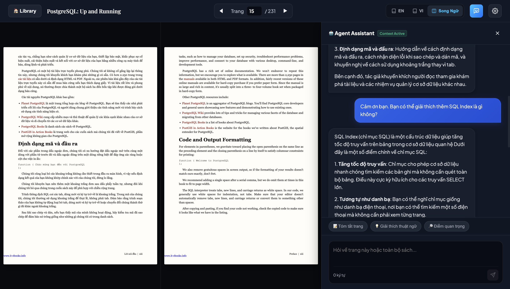

# Bilingual Digital Library & Agent Assistant

Trải nghiệm đọc sách song ngữ (Anh - Việt) cao cấp kết hợp với Trợ lý học tập thông minh. Ứng dụng cung cấp các tùy chọn căn chỉnh bố cục linh hoạt và khả năng tương tác trực quan với tài liệu thông qua mô hình ngôn ngữ lớn (LLM).

## Tính năng nổi bật

- 📖 **Đọc sách song ngữ song song**: Hỗ trợ xem riêng tài liệu gốc tiếng Anh (EN), bản dịch tiếng Việt (VI) hoặc xem song ngữ song song (Split View) tiện lợi.
- 📐 **Bố cục linh hoạt**: Cho phép tùy chỉnh vị trí hiển thị các trang tài liệu (Trái - Phải, Trên - Dưới) trực quan và nhanh chóng qua bảng tùy chọn giao diện.
- ⚡ **Tối ưu hóa hiển thị**: Tự động scale trang sách chuẩn kích thước A4 để vừa vặn với không gian đọc; hỗ trợ cuộn dọc độc lập cho từng ngôn ngữ ở chế độ xếp chồng.
- 🤖 **Agent Assistant thông minh**: Trò chuyện, giải thích thuật ngữ chuyên ngành và tóm tắt nội dung từng trang hoặc toàn bộ cuốn sách theo ngữ cảnh thời gian thực.
- 🎯 **Giao diện không làm sao nhãng**: Các nhãn ngôn ngữ (EN, VI) tự động ẩn đi và chỉ hiện lên mượt mà khi bạn di chuột qua các trang sách.

---

## Giao diện ứng dụng



---

## Hướng dẫn sử dụng

### Bạn làm

1. Copy PDF vào **`books/inbox/`**
2. Yêu cầu Agent xử lý để ingest và render sách.

### Agent làm

```bash
books-cli ingest --pdf books/inbox/<file>.pdf
books-cli render --book books/<slug> --page N --provider cursor --page-pdf
```

Kết quả render sẽ được xuất ra: `books/<slug>/output/en/page_NNNN.html`

Chi tiết cấu trúc sách: [books/README.md](books/README.md) · Agent skill: [.cursor/skills/books-pdf-render/SKILL.md](.cursor/skills/books-pdf-render/SKILL.md)

---

## Triển khai trên Debian Server (Deployment)

Để triển khai ứng dụng trên máy chủ Debian, thực hiện lệnh sau (tự động clone/pull code mới nhất từ GitHub và thiết lập dịch vụ chạy ngầm `systemd` tự động):

```bash
# Clone dự án và chạy thiết lập dịch vụ (chỉ cần chạy lần đầu)
git clone https://github.com/thaonv7995/bilingual-reader.git && cd bilingual-reader && chmod +x deploy.sh && ./deploy.sh

# Từ các lần sau, muốn cập nhật code mới và khởi động lại dịch vụ, chỉ cần chạy:
./deploy.sh
```

Dịch vụ chạy nền với tên `bilingual-reader` tại cổng `27099`. Bạn có thể quản lý dịch vụ qua các lệnh sau:

```bash
# Xem trạng thái dịch vụ
sudo systemctl status bilingual-reader

# Xem log trực tiếp
sudo journalctl -u bilingual-reader -f
```
